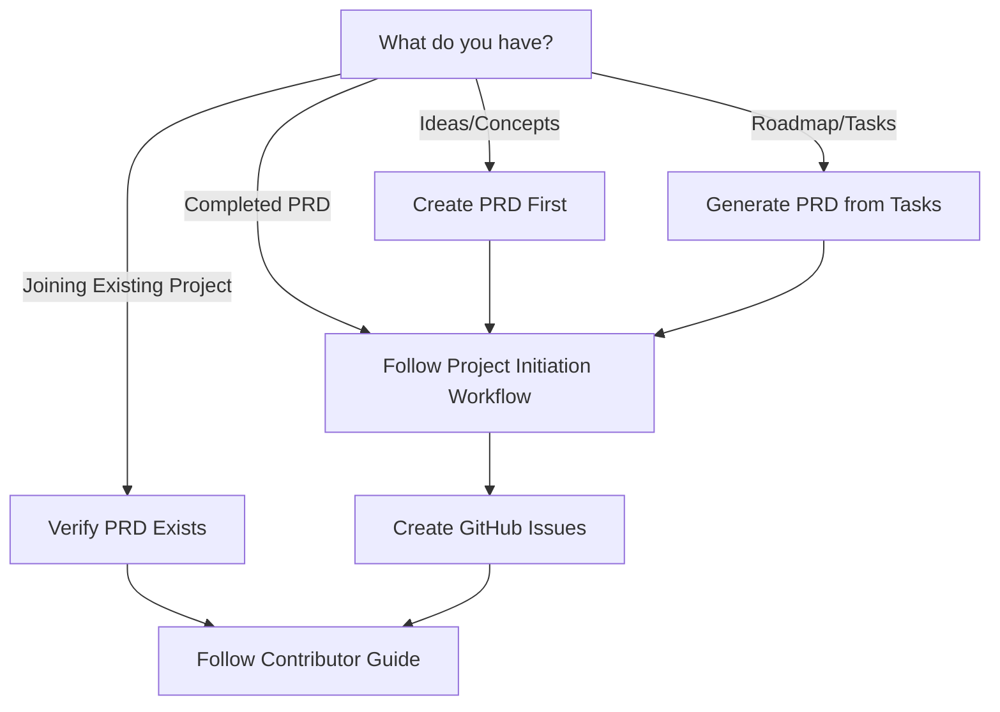

# AI-First Development Environment

This repository is a highly structured template for building software in a collaborative environment of humans and AI agents. It combines a fully automated, containerized development environment with a rigorous, issue-driven, Design-First workflow.

**The goal of this project is to provide a production-ready foundation for building high-quality software with maximum clarity and efficiency.**

---

## 1. The Methodology

This template is built on a core philosophy: **design before you build**. The workflow is designed to ensure that every piece of work is thoroughly planned and documented before implementation begins. This is crucial for effective collaboration with AI agents, who require clear, context-rich instructions.

The project's governing principles are defined in the [**Project Constitution**](docs/00_PROJECT_CONSTITUTION.md), and the mandatory, step-by-step process for all contributors is detailed in the [**Contributor Guide**](docs/01_CONTRIBUTOR_GUIDE.md).

## 2. How to Start

All work in this repository is issue-driven and starts with a Product Requirements Document (`PRD.md`). Use the following decision tree to determine your entry point into the workflow.



| Scenario | Starting Point | Next Step |
| :--- | :--- | :--- |
| **1. Ideas Only** | You have concepts or business requirements. | **Create a PRD** using the [PRD template](docs/templates/PRD-TEMPLATE.md). For AI assistance, see the [AI-assisted PRD guide](docs/how-to/generating-a-prd-with-ai.md). Then, proceed to Scenario 2. |
| **2. Completed PRD** | You have a complete `PRD.md`. | Follow the [**Project Initiation Workflow**](docs/workflows/01-project-initiation.md) to create a backlog of GitHub Issues. |
| **3. Tasks Only** | You have a roadmap or a list of tasks. | **Generate a PRD** from your tasks using the [PRD template](docs/templates/PRD-TEMPLATE.md) to capture the underlying vision. Then, proceed to Scenario 2. |
| **4. Contributor** | You are joining an existing project. | Verify a `PRD.md` exists, then follow the main [**Contributor Guide**](docs/01_CONTRIBUTOR_GUIDE.md) to pick up an issue. |

---

## 3. The Documentation System

The documentation is structured to support the Design-First workflow and is organized as follows:

- **`/docs`**: The root directory for all project documentation.
  - [**`00_PROJECT_CONSTITUTION.md`**](docs/00_PROJECT_CONSTITUTION.md): The immutable principles and hierarchy of truth. **All contributors must read this first.**
  - [**`01_CONTRIBUTOR_GUIDE.md`**](docs/01_CONTRIBUTOR_GUIDE.md): The step-by-step, issue-driven development workflow. **All contributors must follow this.**
  - **`/adr`**: Project-wide Architectural Decision Records (ADRs).
  - **`/issues/[issue-id]`**: Work artifacts (SPEC, PLAN, etc.) for each GitHub Issue.
  - **`/standards`**: Mandatory standards for code, comments, and documentation.
  - **`/templates`**: All document templates (SPEC, PLAN, ADR, etc.).
  - **`/workflows`**: Reusable process guides for tasks like change management and task decomposition.

---

## 4. Repository Layout

```
/docs              Documentation system
  ├── PRD.md       Product vision
  ├── workflows    Executable process guides
  ├── standards    Mandatory conventions
  └── templates    Ready-to-use document scaffolds
/.config           Tooling configuration (mise, sops, etc.)
/.devcontainer     Development environment automation
/.github           CI/CD and GitHub templates
```

---

## 5. License

This project is licensed under the [MIT License](docs/LICENSE).
