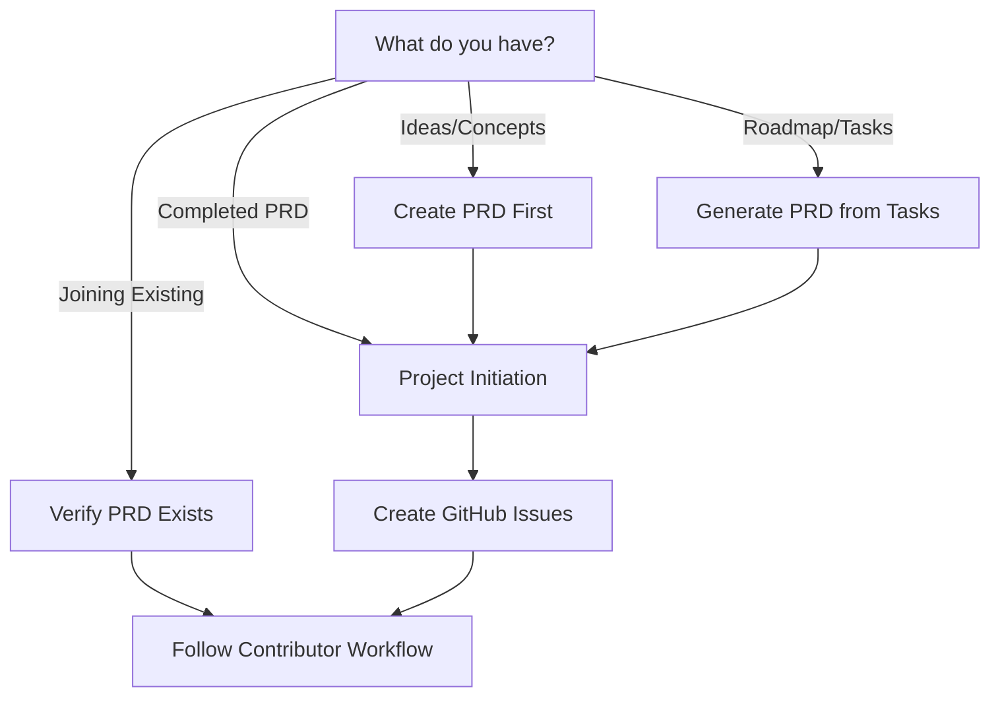

# AI-First Development Environment

This repository is a highly structured template for building software in a collaborative environment of humans and AI agents. It combines a fully automated, containerized development environment with a rigorous, issue-driven, Design-First workflow.

**The goal of this project is to provide a production-ready foundation for building high-quality software with maximum clarity and efficiency.**

## The Methodology

This template is built on a core philosophy: **design before you build**. The workflow is designed to ensure that every piece of work is thoroughly planned and documented before implementation begins. This is crucial for effective collaboration with AI agents, who require clear, context-rich instructions.

To understand the full methodology and how to use this template, you **MUST** begin by reading the documentation suite.

## Start Here

Always begin at the Docs Index: [docs/README.md](docs/README.md). Follow links from there and apply Standards and Universal Gates at every phase.

### 🚀 Scenario 1: Starting with No PRD (Ideas/Concepts Only)

**If you have only ideas, concepts, or business requirements:**
1. **Create a PRD first** using the [PRD template](docs/templates/PRD-TEMPLATE.md)
2. **For AI assistance:** Use the [AI-assisted PRD generation guide](docs/how-to/generating-a-prd-with-ai.md)
3. **Proceed to Scenario 2** once your PRD is complete

### 📋 Scenario 2: Starting with a Completed PRD

**If you have a completed Product Requirements Document (`PRD.md`):**
1. **Follow the [Project Initiation Workflow](docs/workflows/project-initiation.md)**
2. This will guide you through decomposing your PRD into a backlog of actionable GitHub Issues
3. Each issue will then follow the standard Contributor Workflow

### 🔧 Scenario 3: Starting with Roadmap/Tasks Only

**If you have only a roadmap, task list, or TODO items:**
1. **Generate a PRD** from your existing tasks using the [PRD template](docs/templates/PRD-TEMPLATE.md)
2. **Ensure the PRD captures the vision and goals** behind your tasks
3. **Proceed to Scenario 2** for proper project initiation

### 👥 Scenario 4: Contributing to an Existing Project

**If you are a developer joining an existing project:**
1. **Verify a PRD exists** in the project root (`docs/PRD.md`)
2. **Follow the main [Contributor Workflow](docs/CONTRIBUTING.md)**
3. This will guide you through picking up an issue and developing a feature

### 📝 Decision Tree

## License

This project is licensed under the [MIT License](docs/LICENSE).
