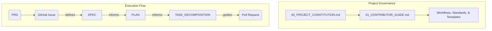

# **01. Contributor Guide**

This document defines the official **issue-driven development workflow** for this project. Adhering to this process is mandatory for all contributors.

**PRD-First Requirement:** Before following this workflow, ensure that a `PRD.md` exists in the project root. If no PRD exists, you **MUST** create one first. No development work may proceed without a PRD.

---

## The System Overview

The diagram below illustrates the relationships between the core governing documents and the artifacts produced during the issue-driven workflow.



---

## The Development Lifecycle

Every change begins with a GitHub Issue and follows this multi-phase lifecycle. At the transition point between each phase, you **MUST** execute the checklist in the [**Universal Gates**](workflows/99-universal-gates.md) workflow.

*   [Phase 1: Concept & Issue Creation](#phase-1-concept--issue-creation)
*   [Phase 2: Plan & Design](#phase-2-plan--design)
*   [Phase 3: Task Decomposition](#phase-3-task-decomposition)
*   [Phase 4: Implement & Verify](#phase-4-implement--verify)
*   [Phase 5: Commit & PR](#phase-5-commit--pr)
*   [Phase 6: Release](#phase-6-release)

---

### **Phase 1: Concept & Issue Creation**

**Goal:** To clearly define a new piece of work derived from the `PRD.md`.

1.  **Create a GitHub Issue:** Use the `gh` CLI and the [**Feature Request template**](templates/FEATURE_REQUEST_TEMPLATE.md) to create a new issue.
2.  **Checkpoint:** Has a clear and detailed GitHub Issue been created, and does it link to the PRD section it implements?

---

### **Phase 2: Plan & Design**

**Goal:** To produce the necessary design documents before implementation.

1.  **Create Work Directory:** Create a `docs/issues/[issue-id]/` directory.
2.  **Assess Complexity:**
    *   For **large or complex features**, you **MUST** create a `SPEC` and a `PLAN` by following the [Specification Writing Guide](standards/s2-specification-writing-guide.md).
    *   For **small, self-explanatory tasks**, you may skip the `SPEC` and `PLAN`.
    *   If the feature requires project-wide technical decisions, follow the [Architectural Decision-Making Protocol](00_PROJECT_CONSTITUTION.md#52-architectural-decision-making) to create an `ADR`.
3.  **Update GitHub Issue:** Post a comment on the issue with links to the design documents.
4.  **Checkpoint:** Have all necessary design documents (`SPEC`, `PLAN`, `ADR`) been created and linked in the issue?

---

### **Phase 3: Task Decomposition**

**Goal:** To translate the `PLAN` into a granular, step-by-step execution plan for an AI agent.

1.  **Generate the Decomposition:** Within `docs/issues/[issue-id]/`, create a `TASK_DECOMPOSITION.md` by following the [**Task Decomposition Workflow**](workflows/03-task-decomposition.md).
2.  **Checkpoint:** Has a `TASK_DECOMPOSITION.md` been created and reviewed?

---

### **Phase 4: Implement & Verify**

**Goal:** To write and verify high-quality code that adheres to the design.

1.  **Implement & Test:** Write the code and corresponding tests as described in the design documents.
2.  **Verify:** Run all local quality checks (`mise run lint`, `mise run test`).
3.  **Checkpoint:** Does the code satisfy the design, and do all tests and linters pass?

---

### **Phase 5: Commit & PR**

**Goal:** To integrate the changes into the main branch after a formal review.

1.  **Commit:** Commit your changes with a clear message referencing the issue number (e.g., `feat: Implement user auth (#123)`).
2.  **Open a Pull Request:** Use the `gh` CLI and the [**Pull Request Template**](templates/PULL_REQUEST_TEMPLATE.md) to open a PR.
3.  **Update Changelog:** Add a summary of your changes to the `CHANGELOG.md`.
4.  **Checkpoint:** Has a Pull Request been opened, reviewed, and approved?

---

### **Phase 6: Release**

**Goal:** To create a new, versioned release of the project.

1.  **Synthesize Documentation:** Create the `ISSUE_SUMMARY.md` as defined in the [Documentation Synthesis Workflow](workflows/06-documentation-synthesis.md).
2.  **Checkpoint:** Has the new version tag been pushed and the documentation synthesized?

---

## Agent & Tooling Interaction

As an AI agent, you **MUST** use the GitHub CLI (`gh`) to interact with GitHub Issues and Pull Requests. This ensures all actions are transparent and auditable.

**Creating an Issue:**
```sh
gh issue create --title "Implement User Authentication" --body-file docs/templates/FEATURE_REQUEST_TEMPLATE.md
```

**Commenting on an Issue with New Documents:**
```sh
gh issue comment 123 --body "I have completed the planning phase. The design documents are now available:\n\n- [SPEC](docs/issues/123/SPEC-NNN-Short-Description.md)\n- [PLAN](docs/issues/123/PLAN-NNN-Short-Description.md)"
```

**Creating a Pull Request:**
```sh
gh pr create --title "feat: Implement user authentication (#123)" --body-file docs/templates/PULL_REQUEST_TEMPLATE.md --assignee @me
```