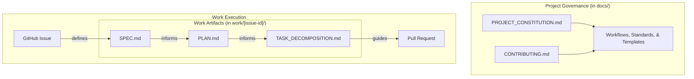

# Documentation Suite Index

Welcome to the central hub for this project's documentation. This document is the starting point for understanding the project's methodology, workflow, and standards.

## The System Overview

The diagram below illustrates the relationships between the core governing documents and the artifacts produced during the issue-driven workflow.

## Governing Documents

These are the core documents that define the project's methodology. They are located in the `docs/` directory.

*   [**`PROJECT_CONSTITUTION.md`**](PROJECT_CONSTITUTION.md): The immutable principles and the hierarchy of truth. **Start here.**
*   [**`CONTRIBUTING.md`**](CONTRIBUTING.md): The step-by-step, issue-driven development workflow.
*   [**`adr/`**](adr/): Contains project-wide Architectural Decision Records (ADRs).
*   [**`workflows/`**](workflows/): Contains detailed guides for specific processes like Decision Making and Task Decomposition.
*   [**`templates/`**](templates/): Contains all official document templates (`SPEC`, `PLAN`, `ADR`, etc.).
*   [**`standards/`**](standards/): Defines coding style, naming conventions, and other standards.
*   [**`examples/`**](examples/): Contains example documents to serve as references.

## Work Artifacts

These documents are created for each GitHub Issue and are stored in a dedicated directory under `work/[issue-id]/`.

*   **`SPEC.md`:** The detailed Functional Specification, including an initial analysis.
*   **`PLAN.md`:** The high-level Technical Plan.
*   **`TASK_DECOMPOSITION.md`:** The granular, step-by-step execution plan.