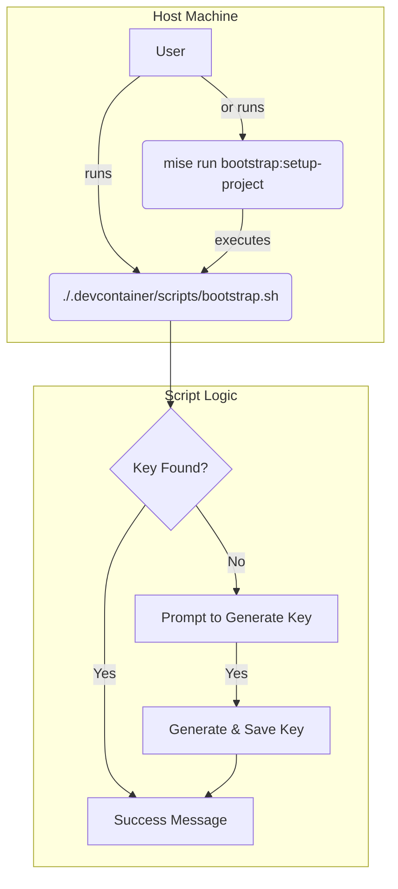

# PLAN-001: Guided Manual Bootstrap and Key Provisioning

*   **Status:** Draft
*   **Author:** Gemini
*   **Created:** 2025-09-28
*   **Last Updated:** 2025-09-28
*   **Related SPEC:** [SPEC-001-Guided-Manual-Bootstrap-and-Key-Provisioning.md](./SPEC-001-Guided-Manual-Bootstrap-and-Key-Provisioning.md)

---

## 1. Objective

To provide a technical plan for a standalone bootstrap script that handles interactive key provisioning, and to define its wrapper as a `mise` task.

## 2. Technical Design

### 2.1. System Components & Flow

The design centers on a primary shell script that can be run directly by the user. A `mise` task is provided for convenience.



### 2.2. Bootstrap Script (`.devcontainer/scripts/bootstrap.sh`)

*   The script will be written in POSIX-compliant shell for maximum portability.
*   It will source `common_helpers.sh` for logging functions.
*   **Logic:**
    1.  Use `log info` to explain what the script is doing.
    2.  Check for existence of `.config/age/keys.txt`.
    3.  If not found, check for `~/.config/sops/age/keys.txt`.
    4.  If neither is found, prompt the user to generate a new key.
    5.  If user agrees, execute `age-keygen`, prompt for a password, and save the encrypted key to `.config/age/keys.txt`.
    6.  If user declines, exit with an error.
    7.  If a key is found or generated, print a success message with instructions for the next step (e.g., running `secrets:edit`).

### 2.3. Mise Task Wrapper (`.config/mise/tasks.toml`)

The `mise` task will be a simple wrapper that executes the bootstrap script.

```toml
[tasks."bootstrap:setup-project"]
description = "Run the initial interactive setup for key generation."
run = "bash ./.devcontainer/scripts/bootstrap.sh"
```

## 3. Rationale & Trade-offs

*   **Approach:** A standalone script is the most robust solution as it removes any dependency on tools (`mise`) being installed on the user's host machine.
*   **Convenience:** Providing a `mise` task wrapper offers a discoverable and convenient way for users who have `mise` installed to run the script.

## 4. Future Considerations

*   The script could be enhanced with flags to allow for non-interactive execution in automated environments (e.g., `bootstrap.sh --force-generate`).
