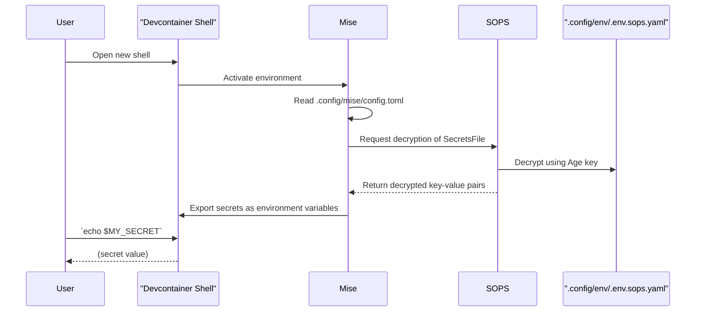

# PLAN-002: Automated Secret Management

*   **Status:** Draft
*   **Author:** Gemini
*   **Created:** 2025-09-28
*   **Last Updated:** 2025-09-28
*   **Related SPEC:** [SPEC-002-Automated-Secret-Management.md](./SPEC-002-Automated-Secret-Management.md)

---

## 1. Objective

To define the configuration of Mise, SOPS, and Age to provide transparent, end-to-end encrypted secret management.

## 2. Technical Design

### 2.1. System Components & Flow

The design is based on the interaction between three core components: `Mise` for runtime environment management, `SOPS` for the encryption/decryption actions, and `Age` as the encryption backend.



### 2.2. Configuration

*   **`.sops.yaml` (Root Directory):** This file configures SOPS's behavior.
    ```yaml
    # .sops.yaml
    creation_rules:
      - path_regex: .*.sops.yaml$
        encrypted_regex: ^(data|stringData)$
        # The public key is retrieved from the key file provisioned in PLAN-001
        age: >-
          age1z... 
    ```

*   **`.config/mise/config.toml`:** This file configures Mise to use the SOPS-encrypted file as an environment source.
    ```toml
    # .config/mise/config.toml
    [env]
    # Mise natively understands that files ending in .sops.yaml need decryption
    files = [".config/env/.env.sops.yaml"]
    ```

*   **`.config/mise/tasks.toml`:** This file defines the helper tasks for interacting with secrets.
    ```toml
    # .config/mise/tasks.toml
    [tasks."secrets:edit"]
    description = "Edit the encrypted secrets file"
    run = "sops .config/env/.env.sops.yaml"

    [tasks."secrets:view"]
    description = "View the decrypted secrets"
    run = "sops --decrypt .config/env/.env.sops.yaml"
    ```

## 3. Rationale & Trade-offs

*   **Approach:** Using Mise's native SOPS integration provides the most seamless experience, as the decryption is automatic upon shell activation.
*   **Alternative Considered:** A manual approach where developers would have to run a script (`source <(sops -d ...)`). This was rejected as it is not transparent and is prone to user error.

## 4. Future Considerations

*   The public key in `.sops.yaml` will need to be updated if the project's encryption key is ever rotated.
