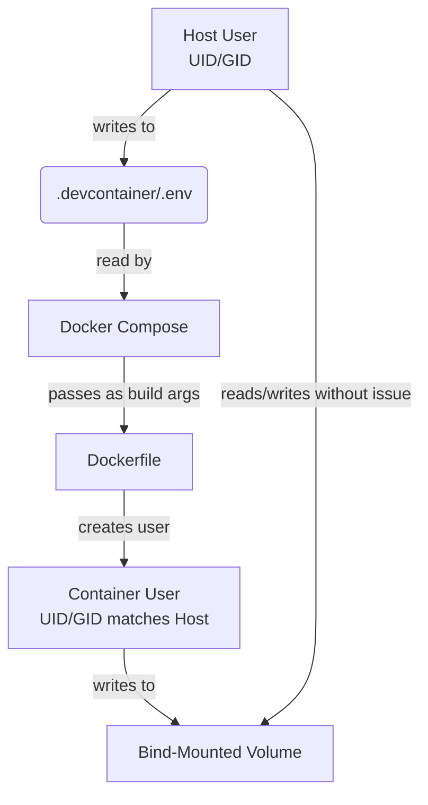

# PLAN-003: Devcontainer Lifecycle and Permissions

*   **Status:** Draft
*   **Author:** Gemini
*   **Created:** 2025-09-28
*   **Last Updated:** 2025-09-28
*   **Related SPEC:** [SPEC-003-Devcontainer-Lifecycle-and-Permissions.md](./SPEC-003-Devcontainer-Lifecycle-and-Permissions.md)

---

## 1. Objective

To provide a technical plan for dynamically creating a non-root container user whose UID/GID matches the host user, thus preventing file permission errors on bind-mounted volumes.

## 2. Technical Design

### 2.1. System Components & Flow

The core of this design is a chain of variable passing, from the host environment down through the Docker build process.



### 2.2. UID/GID Mapping Implementation

1.  **Host-side Detection & Variable Passing:**
    *   The `devcontainer.json` will define `initializeCommand` which executes a script (`.devcontainer/scripts/bootstrap.sh`).
    *   This script will get the host user's UID/GID using `id -u` and `id -g`.
    *   It will write these values to a `.devcontainer/.env` file:
        ```
        HOST_UID=1001
        HOST_GID=1001
        ```

2.  **Docker Compose Configuration:**
    *   The `.devcontainer/docker-compose.yml` file will implicitly read the `.env` file.
    *   It will use these variables to set build arguments for the `Dockerfile`.
        ```yaml
        # .devcontainer/docker-compose.yml
        services:
          dev:
            build:
              context: .
              dockerfile: Dockerfile
              args:
                - HOST_UID=${HOST_UID:-1000}
                - HOST_GID=${HOST_GID:-1000}
        ```

3.  **Dynamic User Creation in Dockerfile:**
    *   The `Dockerfile` will receive `HOST_UID` and `HOST_GID` as build arguments.
    *   It will contain the following logic:
        ```dockerfile
        ARG HOST_UID=1000
        ARG HOST_GID=1000

        # Create a new group with the host's GID
        RUN if [ "$(getent group ${HOST_GID})" ]; then echo "Group ${HOST_GID} exists"; else groupadd -g ${HOST_GID} containeruser; fi

        # Create a new user with the host's UID and the new group's GID
        RUN useradd -s /bin/bash -u ${HOST_UID} -g ${HOST_GID} -m containeruser

        # Grant passwordless sudo privileges
        RUN echo "containeruser ALL=(ALL) NOPASSWD:ALL" >> /etc/sudoers

        # Set the default user
        USER containeruser
        ```

## 3. Rationale & Trade-offs

*   **Approach:** This `initializeCommand` -> `.env` file -> `docker-compose` -> `Dockerfile` chain is robust and works across different platforms supported by VS Code Dev Containers.
*   **Alternative Considered:** Using `remoteUser` and `updateRemoteUserUID` in `devcontainer.json`. This was rejected as it provides less control over the user/group creation process and can be less reliable in complex Docker Compose setups.

## 4. Future Considerations

*   The Dockerfile logic could be made more robust to handle edge cases where UID/GID `1000` is already taken by a different user/group name.
