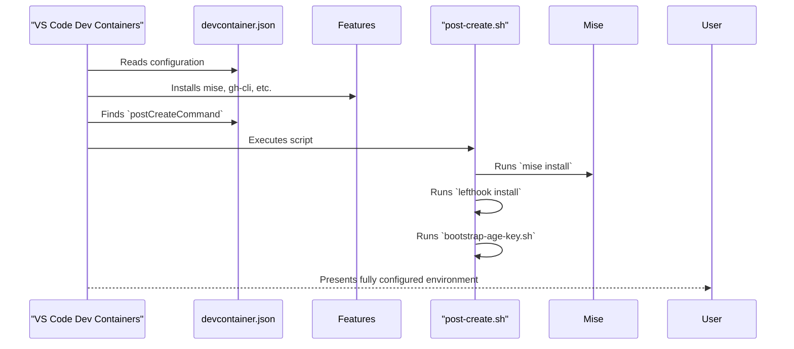

# PLAN-006: Devcontainer Provisioning

*   **Status:** Proposed
*   **Author:** Gemini
*   **Created:** 2025-09-30
*   **Last Updated:** 2025-09-30
*   **Related SPEC:** [SPEC-006-Devcontainer-Provisioning.md](SPEC-006-Devcontainer-Provisioning.md)

---

## 1. Objective

To implement the automated provisioning of the devcontainer environment by uncommenting the relevant `devcontainer.json` sections and re-introducing a `postCreateCommand` to orchestrate tool setup.

## 2. Technical Design

This plan leverages the existing, commented-out configuration within `devcontainer.json` and a new, focused `post-create.sh` script.

### 2.1. System Components & Flow



### 2.2. Implementation Steps

1.  **Restore `post-create.sh`:**
    *   A new script will be created at `.devcontainer/scripts/post-create.sh`.
    *   This script will be simpler than its predecessor and will contain the essential provisioning commands:
        ```bash
        #!/usr/bin/env bash
        set -Eeuo pipefail
        echo "--- Running post-create provisioning ---"
        mise trust --yes
        
        # Install tools with retry logic for network resilience
        max_retries=3
        retry_count=0
        wait_time=5
        until mise install; do
          retry_count=$((retry_count+1))
          if [ ${retry_count} -ge ${max_retries} ]; then
            echo "FATAL: mise install failed after ${max_retries} attempts." >&2
            exit 1
          fi
          echo "mise install failed. Retrying in ${wait_time}s... (Attempt ${retry_count}/${max_retries})"
          sleep ${wait_time}
          wait_time=$((wait_time * 3))
        done
        
        lefthook install

        # Configure Git and GitHub CLI from secrets
        if [ -n "${GIT_USERNAME:-}" ] && [ -n "${GIT_EMAIL:-}" ]; then
          git config --global user.name "${GIT_USERNAME}"
          git config --global user.email "${GIT_EMAIL}"
        fi
        if command -v gh > /dev/null 2>&1 && [ -n "${GITHUB_TOKEN:-}" ]; then
          echo "${GITHUB_TOKEN}" | gh auth login --with-token
        fi

        bash "$(dirname "${BASH_SOURCE[0]}")/bootstrap-age-key.sh"
        echo "--- Post-create provisioning complete ---"
        ```

2.  **Modify `devcontainer.json`:**
    *   The `features` block will be uncommented to enable the installation of `mise`, `github-cli`, and `docker-outside-of-docker`.
    *   The `customizations.vscode` block will be uncommented to provide the quality-of-life extensions and settings.
    *   The `postCreateCommand` property will be added back, pointing to the new `.devcontainer/scripts/post-create.sh` script.
    *   The other example settings (`ports`, `runArgs`, `remoteEnv`, etc.) will be verified to ensure they remain commented out.

## 3. Rationale & Trade-offs

This approach is the most direct way to achieve the desired level of automation. It correctly uses devcontainer `features` for tool installation and a `postCreateCommand` for the subsequent, necessary task of tool *provisioning*. This maintains a clear separation of concerns while fulfilling the requirements of the PRD.
