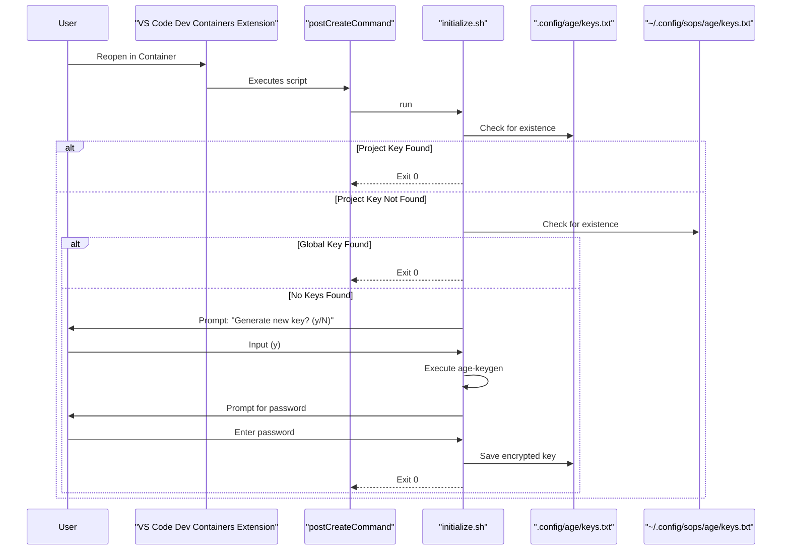

# PLAN-001: Initial Bootstrap and Key Provisioning

*   **Status:** Draft
*   **Author:** Gemini
*   **Created:** 2025-09-28
*   **Last Updated:** 2025-09-28
*   **Related SPEC:** [SPEC-001-Initial-Bootstrap-and-Key-Provisioning.md](./SPEC-001-Initial-Bootstrap-and-Key-Provisioning.md)

---

## 1. Objective

To provide a high-level technical plan for the automated and guided process of provisioning cryptographic keys for secret management during the devcontainer's first startup.

## 2. Technical Design

This process will be primarily managed by a shell script located at `.devcontainer/scripts/initialize.sh`. This script will be invoked by the `postCreateCommand` hook in the `devcontainer.json` file.

### 2.1. System Components & Flow

### 2.2. Key Algorithms & Logic

*   **Key Detection Logic:** The script will use a simple `if/elif/else` file existence check to determine which key to use, prioritizing the project-local key over the global key.
*   **Key Generation:** The script will call the `age-keygen` command-line tool to generate a new key pair. The private key will be encrypted using the `age` tool's native password protection feature.
*   **Helper Scripts:** The `initialize.sh` script will source a `common_helpers.sh` script which provides logging functions (`log info "..."`, `log debug "..."`, `log error "..."`) for standardized output.

## 3. Rationale & Trade-offs

*   **Approach:** A shell script executed by a `devcontainer.json` hook is chosen for its simplicity and direct integration with the VS Code lifecycle.
*   **Trade-off:** This approach relies on user interaction via the terminal. A more complex GUI-based approach was rejected to maintain simplicity and portability.
*   **Alternative Considered:** Performing the check in a script called by `docker-compose` was considered, but `postCreateCommand` is more tightly integrated with the user-facing VS Code setup flow.

## 4. Future Considerations

*   The script could be enhanced to provide more detailed diagnostics if key generation fails.
