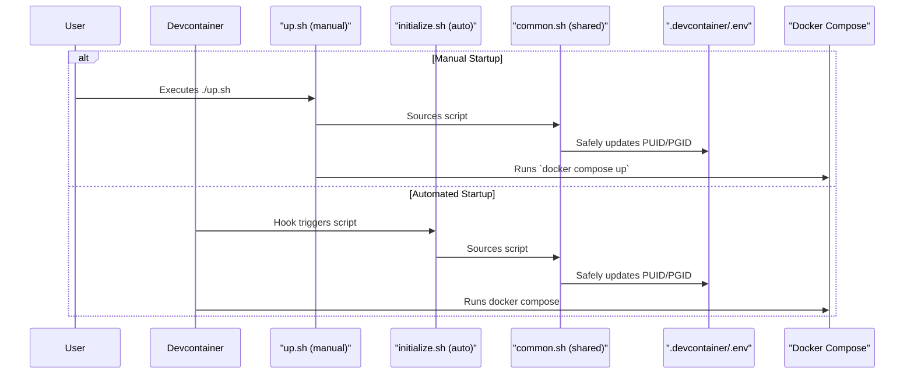

# PLAN-005: Lean Docker Environment Implementation

*   **Status:** Proposed
*   **Author:** Gemini
*   **Created:** 2025-09-30
*   **Last Updated:** 2025-09-30
*   **Related SPEC:** [SPEC-005-Lean-Docker-Environment.md](SPEC-005-Lean-Docker-Environment.md)

---

## 1. Objective

To implement a lean Docker environment by refactoring the `Dockerfile` to handle only user setup, while delegating tool installation to devcontainer features and using an entrypoint for runtime checks.

## 2. Technical Design

The implementation is a refactoring of the existing Docker setup to enforce a stricter separation of concerns.

### 2.1. System Components & Flow

### 2.2. Implementation Steps

1.  **Create `common.sh` Script:**
    *   A new script will be created at `.devcontainer/scripts/common.sh`.
    *   It will contain a single, robust function, `update_or_add_env`, which can safely add or update a key-value pair in a given `.env` file without disturbing other values.

2.  **Refactor `initialize.sh`:**
    *   The script will be simplified to `source` the `common.sh` script and call the `update_or_add_env` function to set the `PUID` and `PGID`.

3.  **Refactor `up.sh` Script:**
    *   This script will also be updated to `source` the `common.sh` script and call `update_or_add_env` before executing the `docker compose` commands.

4.  **Refactor `Dockerfile`:**
    *   The user/group management logic will be restored.
    *   It will be kept lean, installing only `dumb-init` and `sudo`.
    *   It will `COPY` the `entrypoint.sh` and `test-permissions.sh` scripts and set the `ENTRYPOINT`.

5.  **Adapt `entrypoint.sh` and `test-permissions.sh`:**
    *   The `entrypoint.sh` will execute `test-permissions.sh` as a runtime smoke test.
    *   `test-permissions.sh` will be adapted to use environment variables for user/path values to ensure it is not hardcoded.

6.  **Verify `devcontainer.json`:**
    *   Confirm that all devcontainer lifecycle hook properties (`initializeCommand`, etc.) are removed.
    *   Ensure the `features` block is correctly configured to install `mise` and other tools.

## 3. Rationale & Trade-offs

This design is chosen to strictly align with the principle of separating the base environment from the development toolchain. The alternative—baking all tools into the image—creates a monolithic, slow-to-build image and duplicates functionality already available via devcontainer features.

*   **Trade-off:** The standalone environment started with `up.sh` will be minimal. It will not contain the `mise` toolchain. This is an accepted trade-off, as the primary goal for the full environment is the devcontainer experience. The standalone mode is for testing the base image and for users who wish to manage their own tooling.

## 4. Future Considerations

The `entrypoint.sh` is intentionally simple but can be easily extended to add more sophisticated runtime checks or configurations as the project evolves.
