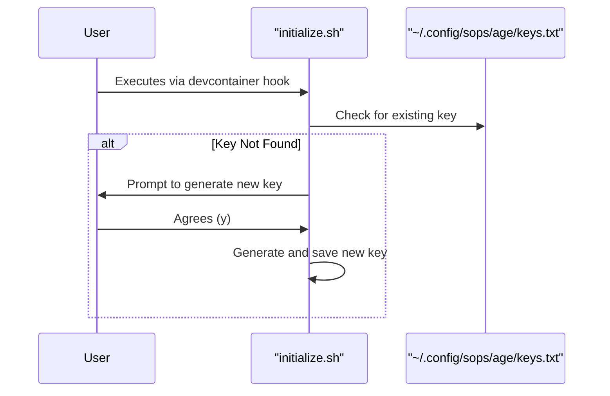

<!--
This document is a template for a Technical Plan (PLAN).
For guidance, see S2. Standard: Specification & Planning Documents in `docs/standards`.
-->

# PLAN-NNN: [Feature Name]

*   **Status:** [Draft | In Review | Approved | Deprecated]
*   **Author(s):** [Author Name]
*   **Created:** [YYYY-MM-DD]
*   **Last Updated:** [YYYY-MM-DD]
*   **Related Issue:** #[Issue ID]
*   **Related SPEC:** [Link to SPEC document]

---

## **1. Objective**

*A concise, one-sentence statement describing the technical approach for implementing the corresponding SPEC.*

---

## **2. Technical Design**

*A high-level overview of the technical implementation. Describe the major components, data models, and interactions. This section should guide an engineer on the architectural approach.*

### **2.1. Data Model**

*Describe any new or modified database schemas, data structures, or objects required to support the feature.*

### **2.2. System Components & Flow**

*Describe the components involved (e.g., scripts, services, containers) and the sequence of interactions between them. Diagrams (e.g., sequence, component, C4) are highly encouraged here to illustrate the design.*

*(Example Sequence Diagram using Mermaid)*

### **2.3. Key Algorithms (if applicable)**

*Describe any specific algorithms or complex logic that are core to the implementation.*

---

## **3. Rationale & Trade-offs**

*Explain why this particular technical design was chosen. Discuss any alternatives that were considered and why they were rejected. Highlight any trade-offs (e.g., performance vs. complexity, security vs. usability).*

---

## **4. Self-Check**

-   Standards applied (`docs/standards/`): [list]
-   DRY & Links validated: [true/false]
-   Gates executed (see `docs/workflows/99-universal-gates.md`): [true/false]

---

## **5. Change History**

| Version | Date       | Author(s)   | Change Description      |
| :------ | :--------- | :---------- | :---------------------- |
| 1.0     | YYYY-MM-DD | [Author(s)] | Initial Draft           |
| 1.1     | YYYY-MM-DD | [Author(s)] | [Description of change] |